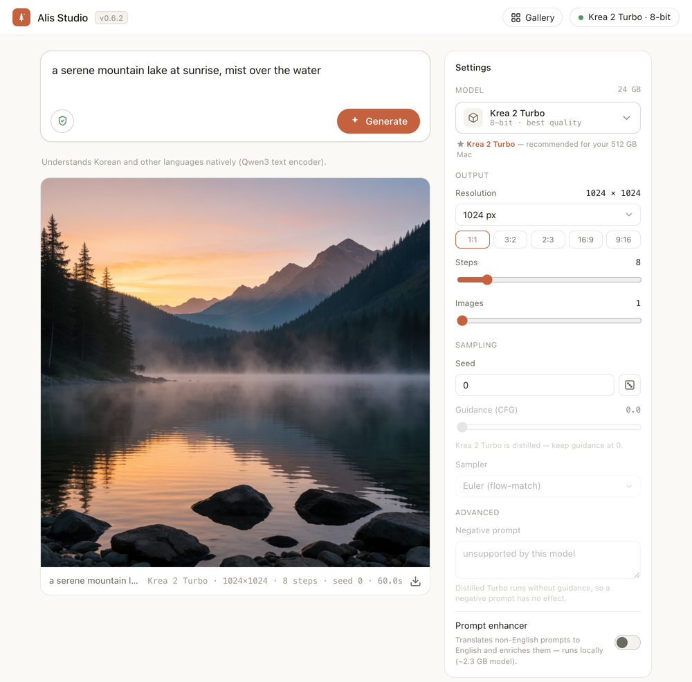

# Alis Studio

A local, **model-agnostic** image-generation studio for **Apple silicon** — a clean, native-feeling
web UI that runs image models entirely on your Mac with [MLX](https://github.com/ml-explore/mlx):
**text-to-image**, **image-to-image** (attach an image and transform it), and **upscaling** (SeedVR2).
No cloud, no accounts, your images never leave your machine.

Ships with **[Krea 2 Turbo](https://github.com/avlp12/krea2_alis_mlx)** (pure-MLX) and
**[Z-Image Turbo](https://huggingface.co/Tongyi-MAI/Z-Image-Turbo)** (Apache-2.0 — a fast 6B model
that **runs on a 16 GB Mac**), plus **Qwen-Image** and **FLUX.1** (schnell / dev) via
[mflux](https://github.com/filipstrand/mflux). On launch it **detects your Mac's memory and
recommends the model that fits best**. More models plug in as small backends — see
[Adding a model](#adding-a-model).



> A real run in the app: pick a model, set resolution + aspect ratio, steps, seed, and more in the
> model-adaptive settings panel, then Generate. (Shown: Krea 2 Turbo 8-bit, 1024², 8-step Turbo.)
> Light and dark follow your system.

---

## Quickstart

**Requires an Apple-silicon Mac (M1+).** **Z-Image Turbo** runs on **16 GB**; the 12.9B
**Krea 2 Turbo** wants **≥ 24 GB**. Alis Studio detects your unified memory and recommends a model
on launch. On macOS use `python3`.

```bash
git clone https://github.com/avlp12/alis-studio.git
cd alis-studio
python3 -m pip install -r requirements.txt
python3 app.py            # opens http://localhost:7860 in your browser
```

Type a prompt, pick a model, click **Generate**. The first run downloads the model weights from
Hugging Face (a few minutes); after that it's instant to start. A 1024² image takes ~50 s on an
M3 Ultra (8-step Turbo; slower chips take longer).

### Run as a native app

Prefer a real window to a browser tab? Run it as a **native macOS app** — its own title bar, dock
icon, and menu, drawn with the system **WKWebView** (no browser or Chromium bundle):

```bash
python3 -m pip install pywebview
python3 desktop.py
```

Same UI and server; the window just hosts it natively. (`alis-studio-desktop` is also installed
as a console script when you `pip install`.)

### Standalone app — build a self-contained `.dmg`

Want something you can just double-click, with no Python or `pip` to set up? Build a self-contained
app that bundles its own Python interpreter **and every dependency** inside the `.app`:

```bash
python3 -m pip install pillow   # optional — for the app icon
bash packaging/build_dmg.sh     # needs `uv`  →  https://docs.astral.sh/uv/
```

This produces `dist/Alis Studio.app` and `dist/Alis-Studio-<version>.dmg` (~400 MB). Open the DMG
and drag **Alis Studio** to Applications, then launch it like any other app — nothing else to
install. As always, the first image downloads the model weights from Hugging Face; those are far
too large to ship inside a DMG.

> The app is **ad-hoc signed**, which is all you need to run it on the Mac that built it. To hand the
> DMG to other machines you'd sign it with a Developer ID and notarize it — otherwise Gatekeeper
> blocks a downloaded, un-notarized app.

- **Detailed settings** — a model-adaptive panel on the right: resolution with aspect-ratio
  presets, steps, batch size, seed (with randomize), guidance, sampler, negative prompt. Each
  model exposes exactly the controls it supports; the panel renders itself from the backend.
- **Model picker** — the **Model** control in Settings opens a popover grouping every model and
  build; switch with a click, **download** (live progress) or delete weights inline, see disk usage.
  The model that best fits your Mac's memory is marked **★ Recommended** and selected by default.
- **Live progress + Stop** — a per-step bar as the model denoises (cumulative across a multi-image
  batch); **Stop** interrupts mid-generation. **Light + dark** follow your system.
- **Low-memory rendering** — on **≤ 24 GB** Macs, large (≥ 1024²) renders use mflux's VAE tiling so
  they fit (Z-Image 1024² peak ~12.9 → ~8.5 GB, no visible quality change); bigger Macs and smaller
  renders keep the exact decode. Override with `ALIS_VAE_TILING=1`/`0`.
- **Bigger images** — per-model max resolution: Krea 2 Turbo up to **2048²** (a native 1K–2K model),
  Qwen-Image 1536², Z-Image / FLUX 1280². The picker warns when a size may not fit your Mac's memory.
- **Image-to-image** — every generation model (**Krea 2 Turbo**, Z-Image, Qwen, FLUX) takes an
  optional **Input image** + **Strength**; attach (or just paste) a picture and transform it with
  your prompt.
- **LoRA** — a shared library for style/subject adapters: paste a download URL (on Civitai, the
  **Download button's link**, not the page URL; on Hugging Face, the file's `/resolve/` URL) or a
  local `.safetensors`, check the ones to apply, set per-LoRA strength — multiple LoRAs stack, and
  Civitai's usual key formats are recognized automatically. Works on Z-Image, CyberRealistic Z,
  Qwen-Image (+Edit), and FLUX — pick LoRAs made for the selected model family. (Z-Image has the
  largest LoRA scene on Civitai.) Auth-gated Civitai files need `CIVITAI_API_TOKEN` in the
  environment (free key from civitai.com/user/account) — easiest when running from a terminal.
- **Restore settings & reproducibility** — every generated image keeps its full recipe (model, size,
  steps, seed, LoRAs); one lightbox click restores everything for a re-run or a tweak (restoring
  turns auto-seed off so the saved seed actually applies). The recipe is also embedded in the PNG
  itself. An **auto-seed** toggle rolls a fresh seed each Generate.
- **Instruction editing** — **Qwen-Image Edit** (Apache-2.0) follows an edit instruction ("make the
  hat red", understands Korean); the output keeps the input's aspect ratio, normalized to ~1 MP
  (≈1024²). Offered in 8-bit / bf16; it's a large model (~54 GB download, **≥ 64 GB** for 8-bit,
  **≥ 96 GB** for bf16), so the picker warns — and the app refuses with a confirm override — when your
  Mac is under a build's memory floor. 4-bit is intentionally omitted: mflux quantizes it to noise.
- **Canvas editor** — hit **Edit** on any image (a fresh result, a gallery item, or **your own
  picture** via the top-bar Edit button, drag-drop, or paste ⌘V) to open a
  Gemini-style editor: **sketch, circle, box, arrow, or drop a text label** (three stroke sizes,
  eight colours, full undo/redo with ⌘Z/⇧⌘Z), then describe the change ("make the circled area
  blue"). The marks are baked into the image handed to Qwen-Image Edit, which follows them and
  paints the drawing back out. Results land in a **step-history strip** — click any step (including
  the original) to go back and branch from there; **Fast/Fine** picks 4- or 8-step quality, and each
  run uses a fresh seed so "Edit" again gives a new take. (Needs the Qwen-Image Edit backend, so a
  ≥ 64 GB Mac.)
- **Upscale** — open any gallery image and **Upscale 2× / 3×** with [SeedVR2](https://github.com/ml-explore)
  diffusion super-resolution (3B, Apache-2.0). Model downloads on first use; available on Macs with ≥ 24 GB.
- **Gallery** — every generation is saved; click a thumbnail (or its prompt) for a lightbox with the
  full **editable** prompt, plus Use / Copy / Download / Delete.
- **NSFW safety filter** runs by default (pure-MLX, no PyTorch); toggle it with the shield icon.
- Bind to your LAN with `ALIS_HOST=0.0.0.0 python3 app.py` (only on networks you trust); change
  the port with `ALIS_PORT=7861`.

---

## Models

The **Model** section in Settings (and the whole settings panel) is built from whatever backends are
installed — the UI discovers them at startup via `/api/models` and `/api/catalog`, so adding a model
needs no UI changes. Each model's builds are grouped under its name; switch with **Use**, manage
downloads inline, and switching **builds of the same model** frees the previous one (two big builds
won't fit at once). Switching **between models** on a Mac with ≤ 32 GB frees the previous model
automatically (two pipelines won't fit); bigger Macs keep it cached for instant switch-back.

| Model | Builds | Download |
|---|---|---|
| **Krea 2 Turbo** | 8-bit (14.2 GB) · mixed-4/8 (9.8 GB). 8-step Turbo. Wants ≥ 24 GB RAM. | managed in-app (resumable, with progress) |
| **Z-Image Turbo** | 4-bit (~6 GB) · 8-bit · bf16. 9-step Turbo, Apache-2.0. **Runs on 16 GB**; multilingual (Qwen3 encoder). | auto on first use via mflux |
| **CyberRealistic Z** | 4-bit (~5.5 GB, **runs on 16 GB**) · 8-bit (~10 GB, ≥ 24 GB). [Civitai](https://civitai.com/models/2218365) photorealism finetune of Z-Image Turbo by [Cyberdelia](https://civitai.com/user/Cyberdelia) (OpenRAIL-M). Separate weights from the base model. | auto on first use ([mlx build](https://huggingface.co/avlp12/CyberRealistic-Z-Image-Turbo-v4-mflux-4bit)) |
| **Qwen-Image** | 8-bit, bf16. Apache-2.0, open. (No 4-bit — its ~20B transformer gets grainy below 8-bit.) | auto on first use via mflux (~40 GB) |
| **Qwen-Image Edit** | 8-bit (needs ≥ 64 GB) · bf16 (≥ 96 GB). Apache-2.0 instruction editing. (No 4-bit — mflux quantizes it to noise.) | auto on first use via mflux (~54 GB) |
| **FLUX.2 klein 4B** | 4-bit (**runs on 16 GB**) · 8-bit · bf16. BFL's 2026 fast model, ~4 steps, Apache-2.0, **ungated**. img2img + LoRA. | auto on first use via mflux (~15 GB) |
| **FLUX.1 schnell** | 8/4-bit, bf16. Apache-2.0 weights, **gated repo**. | auto on first use via mflux (~24 GB) |
| **FLUX.1 dev** | 8/4-bit, bf16. Non-commercial, **gated**. | auto on first use via mflux (~24 GB) |

Krea 2 Turbo ships **explicit** download management (our own resumable HTTP-bridge downloader with a
live progress bar). The FLUX / Qwen-Image backends are handled by [mflux](https://github.com/filipstrand/mflux),
which downloads the weights on first **Generate**. The **FLUX** repos are **gated** — accept the
license on Hugging Face and run `huggingface-cli login` first, or Alis Studio shows an actionable
error. Qwen-Image is open and needs no access.

---

## Adding a model

Drop a file in `studio/backends/`, subclass `Backend`, and register it. The backend *declares*
its settings (`params`) and downloadable builds (`catalog`); the UI renders the settings panel and
the model manager from those declarations — no UI code to touch.

```python
# studio/backends/mymodel.py
from .base import Backend

class MyBackend(Backend):
    id = "my-model"
    label = "My Model"
    variants = [{"id": "default", "label": "default"}]
    # settings the UI renders into the right-hand panel (see studio/backends/base.py for all types):
    params = [
        {"key": "resolution", "label": "Resolution", "type": "resolution", "group": "Output",
         "sizes": [512, 1024], "default_size": 1024, "aspects": ["1:1", "3:2", "16:9"],
         "default_aspect": "1:1", "min": 256, "max": 1536, "multiple": 16},
        {"key": "steps", "label": "Steps", "type": "int", "group": "Output", "min": 1, "max": 50, "default": 20},
        {"key": "guidance", "label": "Guidance", "type": "float", "group": "Sampling",
         "min": 0, "max": 12, "step": 0.5, "default": 7.5},
        {"key": "seed", "label": "Seed", "type": "seed", "group": "Sampling", "default": 0},
    ]
    catalog = [{"variant": "default", "label": "default", "size_gb": 6.0, "note": "fp16"}]

    @classmethod
    def is_available(cls):
        try:
            import my_package  # noqa
            return True
        except Exception:
            return False

    def generate(self, *, prompt, variant, params, step_callback):
        # params carries width, height, steps, seed, num_images + your custom keys.
        # call step_callback(step, total) per denoising step for the live progress bar.
        return [pil_image, ...]

    # optional — enables the model manager's download / delete / installed state:
    def is_installed(self, variant): ...
    def download(self, variant, progress): ...   # call progress(done_bytes, total_bytes)
    def delete(self, variant): ...
```

Then add it to `studio/registry.py`:

```python
from .backends.mymodel import MyBackend
BACKENDS = [Krea2Backend, MyBackend]
```

Backends whose dependencies aren't installed are skipped automatically, so the app always runs
with whatever you have.

---

## How it works

- `app.py` → `studio/server.py` — a Python **standard-library** HTTP server (zero web dependencies).
  Serves `web/index.html` and a small JSON/NDJSON API:
  - `GET /api/models` — registered models + their settings schema (drives the dropdown + settings panel)
  - `POST /api/generate` — streams NDJSON: one line per denoising step, then the base64 PNGs
  - `GET /api/catalog` · `POST /api/download` (streamed progress) · `POST /api/delete` — the model manager
- `studio/registry.py` — the list of available models.
- `studio/backends/` — one file per model; each wraps a model behind the small `Backend` interface.
- `studio/download.py` — the resilient HTTP-bridge downloader (resumable, integrity-checked).

Generation is serialized (one GPU, one job at a time). The NSFW filter is applied at the app level
to every backend's output, reusing Krea 2's pure-MLX classifier.

---

## Privacy & license

Everything runs **locally** — prompts and images never leave your Mac.

This application is **MIT** licensed ([`LICENSE`](LICENSE)). **Each model carries its own license:**
the Krea 2 Turbo backend uses weights under the
[Krea 2 Community License](https://krea.ai/krea-2-licensing) (commercial use requires annual revenue
under $1M; content filtering required for deployments — the built-in filter is on by default), and
**CyberRealistic Z** is **CreativeML OpenRAIL-M** — use-based restrictions apply; see the
[model card](https://huggingface.co/avlp12/CyberRealistic-Z-Image-Turbo-v4-mflux-4bit). You're
responsible for complying with the license of any model you load.

*Part of the **Alis** MLX line — see also [krea2_alis_mlx](https://github.com/avlp12/krea2_alis_mlx).*
